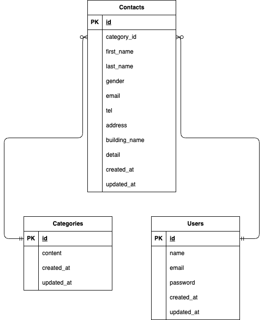

# Contact Form Project

## 概要
お問い合わせフォーム作成の課題プロジェクトです。

## 環境構築

1. リポジトリをクローンする
    ```bash
    git clone git@github.com:Kay-sep27/contact-form-test.git  
    cd contact-form-test
    ```

2. Dockerコンテナをビルド・起動する
    ```bash
    docker compose up -d --build
    ```

3. Laravelコンテナに入る
    ```bash
    docker compose exec app bash
    ```

4. Laravelのパッケージをインストール
    ```bash
    composer install
    ```

5. `.env` ファイルを作成する
    ```bash
    cp .env.example .env
    ```

6. アプリケーションキーを生成する
    ```bash
    php artisan key:generate
    ```

7. マイグレーション＆シーディングを実行（ダミーデータ作成）
    ```bash
    php artisan migrate --seed
    ```

8. アプリケーションにアクセス
    ```
    http://localhost/
    ```

## 使用技術

- 言語・フレームワーク：Laravel 8.x / PHP 7.4  
- インフラ環境：Docker（nginx, PHP, MySQL, phpMyAdmin）  
- データベース：MySQL 8.0  
- ライブラリ・パッケージ：
  - Laravel Fortify（認証機能）
  - Faker（ダミーデータ生成用）
  - Bootstrap（モーダル表示）
- 開発ツール：
  - VS Code
  - phpMyAdmin（DBの可視化）
  - Laravel Artisan（CLI操作）

## 機能一覧

### 一般ユーザー向け

- お問い合わせフォーム入力ページ `/`
- 確認ページ `/confirm`
- サンクスページ `/thanks`

### 管理者向け

- 管理画面 `/admin`
  - 名前・メールアドレス・性別・種類・日付による検索機能
  - ページネーション（7件ずつ表示）
  - お問い合わせ詳細をモーダルで表示
  - お問い合わせの削除（モーダル内で可能）
  - CSVエクスポート機能 `/export`

### 認証機能（Fortify）

- ユーザー登録 `/register`
- ログイン `/login`
- フォームリクエストによるバリデーション  
  └ 各入力欄の下にエラーメッセージを表示

## ER図

以下は本アプリケーションのER図です：



- テーブル名：スネークケース、複数形
- カラム名：スネークケース

## ダミーデータ

以下のファクトリーでデータを生成：

```php
\App\Models\Category::factory(5)->create();
\App\Models\Contact::factory(35)->create();
```

## 実装内容
- お問い合わせフォーム（入力、確認、送信）
- ユーザー登録・ログイン（Fortify使用）
- 管理画面（検索、詳細表示、削除）

## URL
-開発環境：http://localhost/

## README更新履歴
- 2025-07-06 作成
